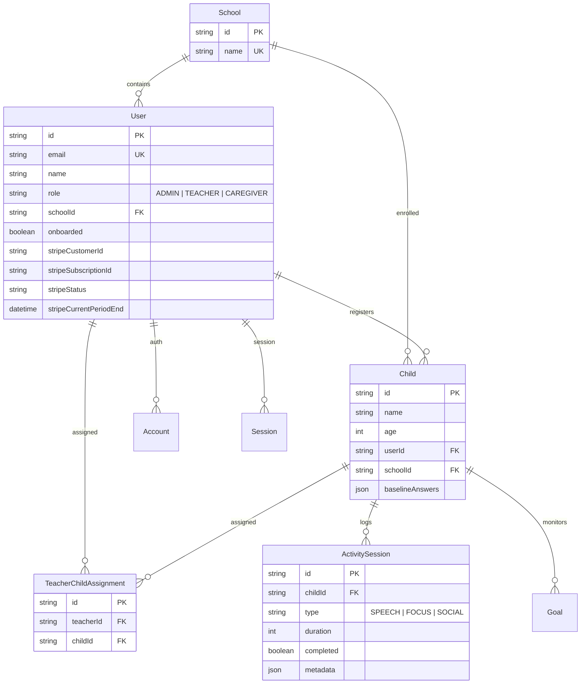
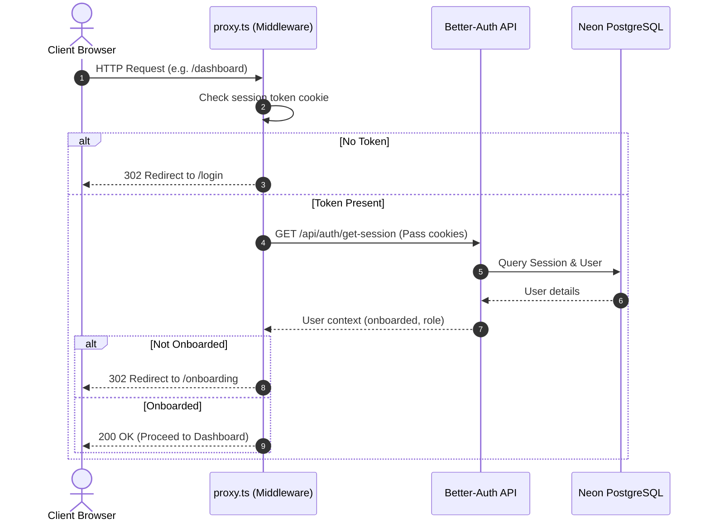

# Architecture & Technical Stack

The NeuroSense Africa codebase is a modern TypeScript-first stack built on top of the Next.js App Router and a serverless PostgreSQL database.

---

## Core Technologies

- **Frontend Core**: React 19, Next.js 16 (App Router), Tailwind CSS 4, and Lucide React icons.
- **Backend Core**: Next.js Server Components, API Route Handlers, and Edge-compatible runtimes.
- **Database & ORM**: Neon PostgreSQL database managed via Prisma ORM.
- **Authentication**: Better-Auth with Prisma Adapter, custom hooks, and email reset handlers.
- **Billing & Subscriptions**: Stripe API, Customer billing portal redirection, and webhook listeners.
- **Email Delivery**: Resend Node.js SDK and custom transactional templates.

---

## Database Schema Model

The PostgreSQL schema is structured to accommodate the three core user roles (Admins, Teachers, Caregivers) while strictly enforcing school boundaries.

### Key Relationships
- **Multi-Tenant Boundaries**: Every `Child` and `User` associated with an institution links to a `School` record via `schoolId`.
- **Assignments Join Table**: `TeacherChildAssignment` maps teachers to specific child profiles, allowing granular classroom access control.
- **Telemetry Storage**: `ActivitySession` stores detailed JSON logs (e.g. pauses, errors, articulations) inside a flexible PostgreSQL `Json` field.

---

## Authentication Workflow

We use **Better-Auth** for authentication. Session verification is handled at the network edge using Next.js request middleware.

### Hook Orchestration (`lib/auth.ts`)
- **School Signups**: During registration, if a user provides a `schoolName`, the `before` hook queries if it exists. If it is a new school, it creates the `School` record and sets the user's role to `"ADMIN"`. If it exists, the user is created with a `"TEACHER"` role under that school.
- **Transactional Welcome Emails**: The `after` hook triggers a welcome email via Resend in a non-blocking asynchronous call to prevent SMTP latency from blocking Prisma database connections.
