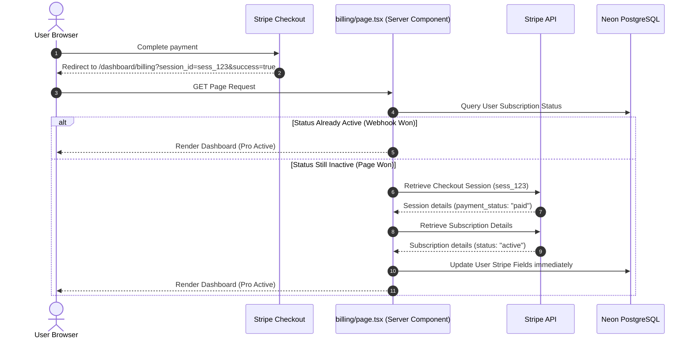

# Billing & Stripe Integration

NeuroSense Africa uses Stripe for billing and subscription management. Pro tier pages are paywalled, and subscriptions are synchronized automatically via webhooks and page self-healing.

---

## Subscription Pricing Tiers

- **Pro Monthly**: **$30.00 / month** (Lookup Key: `neurosense_pro_monthly_30`)
- **Pro Annual**: **$240.00 / year** (Lookup Key: `neurosense_pro_annual_240` - equivalent to $20/month, saving 33%)

---

## Checkout & Self-Healing Provisioning

### 1. Stripe Checkout Redirection (`/api/billing/checkout`)
When a user clicks "Upgrade to Pro", they are redirected to our checkout API endpoint. 
- **Self-Healing Stripe Products**: If the monthly or annual price objects do not exist in the connected Stripe developer account, the API automatically creates the Product and Price metadata on-the-fly:
  ```typescript
  const price = await stripe.prices.create({
    product: productId,
    unit_amount: plan === "monthly" ? 3000 : 24000,
    currency: "usd",
    recurring: { interval: plan === "monthly" ? "month" : "year" },
    lookup_key: priceLookupKey,
    transfer_lookup_key: true,
  });
  ```
- **Checkout Session**: Generates a Stripe Checkout session and redirects the main browser window to Stripe.

### 2. Standard HTML Anchor Navigation (`<a>` vs `<Link>`)
Because the checkout and billing portal endpoints perform server-side HTTP redirections, the frontend uses standard HTML `<a>` tags instead of Next.js client-side `<Link>` tags. This ensures cookies are sent natively, avoiding pre-fetch route validation errors.

---

## Stripe Webhook Handler (`/api/billing/webhook`)

Stripe calls our webhook handler asynchronously to notify the server of subscription state changes. The webhook endpoint verifies the request signature securely using the `STRIPE_WEBHOOK_SECRET`.

### Supported Event Cases
1. **`checkout.session.completed`**: Resolves the user's ID via session metadata and maps the `stripeCustomerId`, `stripeSubscriptionId`, `stripePriceId`, and `stripeStatus` to their record.
2. **`customer.subscription.updated`**: Triggered when a plan is updated, trialing ends, or billing updates. Synchronizes status and period end-dates in PostgreSQL.
3. **`customer.subscription.deleted`**: Triggered on cancellations. Resets subscription status.

---

## Webhook Latency Self-Healing on Redirect

To resolve the race condition where a user returns from checkout before the webhook has processed (or when testing locally without running the Stripe CLI webhook forwarder), the billing page (`/app/dashboard/billing/page.tsx`) contains a self-healing check:



This ensures that the very first page load after checkout correctly shows **Pro Active**, even under network latency.
