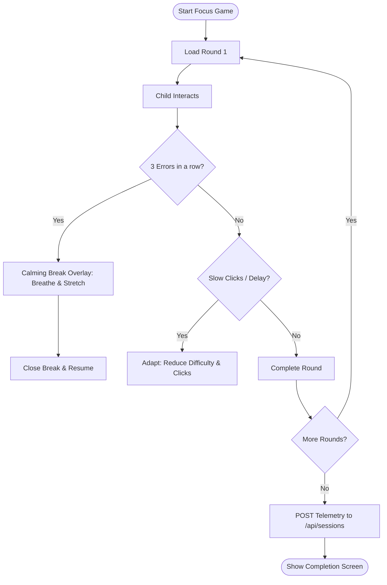

# Educational & Learning Modules

NeuroSense Africa provides three interactive learning pathways to assist children with developmental differences. All sessions record performance metrics locally and submit them to the database.

---

## 1. Speech Practice (Listen & Repeat / Point & Say)

The speech practice modules focus on articulation confidence without clinical diagnostic pressure.

### Listen & Repeat
- **Core Action**: A word and simple flat illustration are shown. High-quality audio plays automatically.
- **Audio Fallbacks**: If CDN audio files are missing or loading fails, the system falls back to the browser's native **Web Speech Synthesis API** to speak the word:
  ```javascript
  const utterance = new SpeechSynthesisUtterance(wordText);
  window.speechSynthesis.speak(utterance);
  ```
- **Positive Encouragement**: Displays randomized encouraging messages (e.g. *"Great job! Take your time."*) that never repeat consecutively.

### Point & Say
- **Core Action**: Shows a 2x2 grid of simple images. An audio prompt plays automatically (e.g. *"Where is the school?"*).
- **Correct Selection**: Gentle green glow animation, a positive sound effect, and transition to the next card after 1.5 seconds.
- **Incorrect Selection**: Neutral audio replay prompt without negative sound effects or red errors, preserving child confidence.

---

## 2. Focus Skills (Memory Match / Shape Sequencing / Spot Difference)

Designed for children with Autism or ADHD. Focus modules implement pacing limits, AI-adaptive layouts, and frustration break overlays.



### AI-Adaptive Difficulty
- **Pacing Metrics**: If the system detects high interaction latency (long pauses) or signs of rapid click fatigue (attention drop), it dynamically shortens the session (e.g., reducing requirements from 5 rounds down to 3).
- **Frustration Control**: Tracks consecutive incorrect selections. If 3 consecutive errors occur, a calming overlay interrupts gameplay, inviting the child to pause, stretch, and take deep breaths.

---

## 3. Social Skills (Interactive Stories & Vocabulary Toggle)

Social modules expose children to real-world scenarios (sharing, greetings, emotions) through visual story cards.

### Goal-Based Sorting
When the page loads, it queries `/api/profile` to retrieve the child's baseline goals. Lessons matching their goals (e.g. *"Promote Sharing & Turn-Taking"*) are sorted first and highlighted to optimize educator workflows.

### Branching Narrative Choices
Stories present choice points (e.g. *"Share the toy"* vs *"Keep the toy"*). 
- **Non-cooperative Choice**: Shows direct social consequences (e.g. *"Your classmate feels sad. Try again."*) and prompts retry.
- **Cooperative Choice**: Awards positive feedback and advances the lesson.

### Vocabulary Level Toggle (Low-Reading Mode)
A global vocabulary switch allows parents or classroom educators to simplify the story copy. 

```typescript
// Sample text simplification logic
const storyText = isSimplified 
  ? "Kwame shares the block. Kofi is happy." 
  : "Kwame decides to share his building blocks with Kofi, and they build a tall tower together.";
```
This reduces reading load instantly for children who are younger or have severe speech differences.
